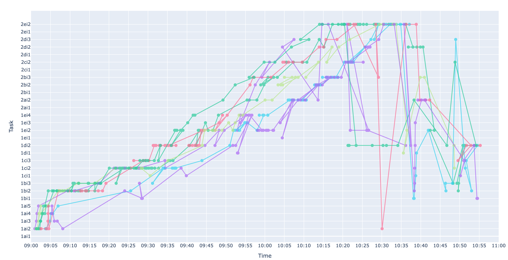

# Answer Sequence Analysis for Online Examinations

> **Imperial College London Individual Project**  
> Exploring how learning analytics and educational data mining (EDM) can enhance online assessments through answer submission sequence analysis.

## 📌 Overview

This repository contains the implementation and findings of a comprehensive study on online examination analytics. The project focuses on analyzing student answer submission sequences to support invigilation dashboards and improve post-exam feedback.

## 🎯 Objectives

- [x] Model and cluster student answer sequences to identify behavioral patterns
- [x] Develop actionable visualizations and analytics for instructors

## 🏗️ System Architecture

### Platform: AnswerBook Online Examination System

```
┌─────────────────┐    ┌─────────────────┐    ┌─────────────────┐
│   Frontend      │    │    Backend      │    │   Database      │
│                 │    │                 │    │                 │
│ • Bootstrap     │◄──►│ • Flask         │◄──►│ • PostgreSQL    │
│ • JavaScript    │    │ • Flask-REST    │    │ • Event Logs    │
│ • Server-side   │    │ • Gunicorn      │    │ • User Data     │
│   Rendering     │    │ • Docker        │    │                 │
└─────────────────┘    └─────────────────┘    └─────────────────┘
```

### Data Pipeline Features

- **Event-driven Architecture**: Captures every student submission in real-time
- **Incremental Saving**: Prevents data loss during exam interruptions
- **State Restoration**: Supports recovery of partially completed answers
- **Scalable Storage**: Handles large-scale concurrent examinations

## 🔬 Methodology

### Answer Sequence Analysis

Two complementary approaches were developed and compared:

#### Vector-based Clustering
- **Strengths**: Simple, interpretable, computationally efficient
- **Limitations**: Limited capture of temporal dynamics and sequential patterns

#### Graph Embedding + LSTM Sequential Modeling
- **Advantages**: Captures complex temporal relationships
- **Results**: More coherent, pedagogically interpretable clusters
- **Identified Patterns**:
  - Sequential completion strategies
  - Backtracking behaviors
  - Systematic review patterns
  - Time-based submission patterns

## 📊 Key Findings

### Behavioral Clustering Results
- Successfully identified distinct exam-taking strategies
- Clusters showed pedagogical relevance for instructor feedback
- Visualizations revealed insights invisible in raw log data

### Pedagogical Applications
- **Integrity Monitoring**: Detection of anomalous behavioral patterns
- **Learning Insights**: Understanding common student strategies
- **Feedback Enhancement**: Data-driven post-exam discussions

## 🚀 Implementation

### Quick Start

```bash
# Clone the repository
git clone https://github.com/your-username/answer-sequence-analysis.git
cd answer-sequence-analysis

# Install dependencies
pip install -r requirements.txt

# Run data analysis pipeline in notebook

```

### Project Structure

```
├── src/
│   ├── models/           # LSTM, clustering, embedding models
│   ├── utils/            # Data processing utilities
│   ├── visualization/    # Plot generation and dashboard components
│   └── analysis/         # Main analysis scripts
├── data/                 # Sample datasets and processed results
├── notebooks/            # Jupyter notebooks for exploration
├── visualization/        # Generated plots and HTML reports
└── docs/                 # Documentation and reports
```

## 📈 Results & Visualizations

### Student Behavior Clustering



## 🔮 Future Directions

### Short-term Goals
- [ ] Real-time invigilation dashboard integration
- [ ] Expanded dataset validation across different subjects
- [ ] Enhanced transformer-based NLP for short answers

### Long-term Vision
- [ ] Human-in-the-loop cluster refinement systems
- [ ] Advanced student feedback visualization tools
- [ ] Cross-institutional deployment and validation
- [ ] Integration with learning management systems

## 📚 Publications & Documentation

- [Technical Report](docs/Imperial_College_Individual_Project_Final_Report.pdf)
